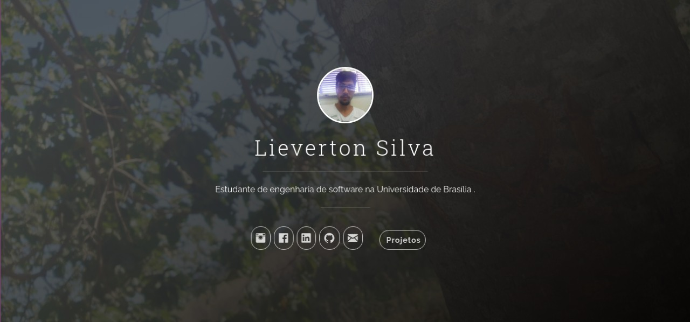

# Jekyll-Uno with Projects as Timeline
A Jekyll Theme, based on the Uno-Theme with a list of projects as Timeline.

## Desktop

## Mobile

## Installation/Setup
1. Download or clone repo `git clone https://github.com/lievertom/lievertom.github.io.git`
2. Enter the folder: `cd lievertom.github.io`
3. Build it: `jekyll build`
4. Start Jekyll server: `jekyll serve`
5. Configure: `_config.yml`
   * at least set `font_awesome` or download and add the font in `head.html`

Access via: [http://localhost:4000/](http://localhost:4000/)